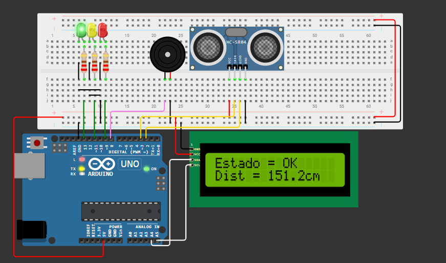
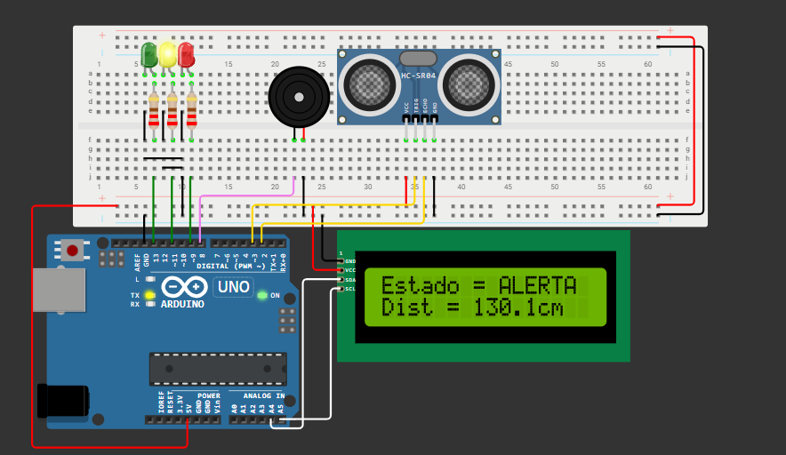
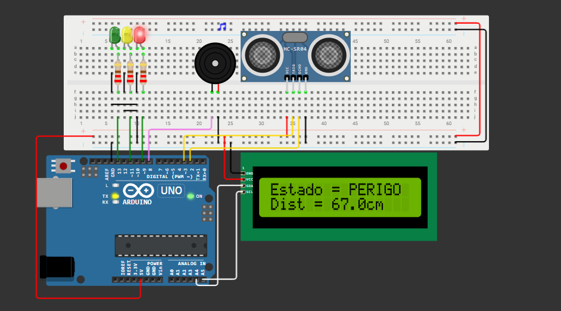

# GS-Edge
Entrega da Global Solution da matéria Edge Computing and Computer Systems na FIAP

## 🌊 Descrição do Problema
O monitoramento de rios em áreas urbanas é essencial para prevenir enchentes e alertar a população com antecedência. Muitas regiões sofrem com alagamentos causados pelo aumento repentino do nível da água, principalmente durante períodos de chuvas intensas. A ausência de sistemas de alerta em tempo real pode colocar vidas em risco.

## 💡 Visão Geral da Solução
Desenvolvemos um sistema embarcado utilizando um sensor ultrassônico HC-SR04, um LCD I2C e três LEDs de sinalização, além de um buzzer sonoro. O objetivo do sistema é:

- Medir continuamente a distância entre o sensor e a superfície do rio.
- Classificar a situação do rio em três níveis:
    - OK (nível seguro)
    - ALERTA (nível de atenção)
    - PERIGO (nível crítico)
- Exibir o estado atual e a distância medida no LCD.
- Acionar o buzzer apenas nos estados de ALERTA e PERIGO com diferentes padrões de aviso.

## 🎯 Faixas de classificação:
- OK: distância > 150 cm
- ALERTA: 100 cm < distância ≤ 150 cm
- PERIGO: distância ≤ 100 cm

## 🖥️ Interface Visual
#### 📟 LCD:
- Linha 1: Estado atual (OK, ALERTA, PERIGO)
- Linha 2: Distância em cm (Dist = 132.4cm)

#### 💡 LEDs:
- Verde (OK): Indica situação normal.
- Amarelo (ALERTA): Indica necessidade de atenção.
- Vermelho (PERIGO): Indica risco iminente.

#### 🔊 Buzzer:
- Emite sons intermitentes em ALERTA.
- Emite sons contínuos e mais frequentes em PERIGO.
- Silenciado no estado OK.

## 📸 Exemplos Visuais do Sistema em Funcionamento

### ✅ Estado OK

### ⚠️ Estado de Alerta

### 🚨 Estado de Perigo

## 🛠️ Como Simular no Wokwi
1. Acesse o projeto no link abaixo.
2. Clique em "Start Simulation".
3. Use o slider do sensor ultrassônico para simular o nível da água subindo ou descendo.
4. Observe a mudança no LCD, nos LEDs e no som do buzzer.

✅ Link direto para simulação no Wokwi: 🔗 [Acessar a simulação no Wokwi](https://wokwi.com/projects/432133929837943809)

## 📹 Vídeo Demonstrativo
Veja o funcionamento prático do projeto com explicação detalhada: [🎬 Assistir Vídeo Demonstrativo]()

## 📄 Código-fonte
Todo o funcionamento do sistema de monitoramento com LEDs, buzzer, sensor ultrassônico e display LCD está implementado no código Arduino a seguir:

[👉 Visualizar código no GitHub](https://github.com/DaviMunhoz1005/GS-Edge/blob/main/main.cpp)

## ⚙️ Componentes Utilizados
- Arduino Uno
- Sensor Ultrassônico HC-SR04
- LCD 16x2 com interface I2C
- LEDs: Verde, Amarelo e Vermelho
- Buzzer ativo
- Resistores
- Jumpers e Protoboard

## 📁 Estrutura do Código
- `setup()`: inicializa pinos, LCD e estado inicial.
- `loop()`: executa continuamente a leitura do sensor, define estado, atualiza display, LEDs e buzzer.

- Funções auxiliares:
    - `takeDistanceSensor()`: mede a distância.
    - `checkState()`: define o estado com base na distância.
    - `ledsOnOff()`: ativa os LEDs adequados.
    - `displayTwoLines()`: atualiza o LCD.
    - `handleBuzzer()`: gerencia os padrões de som.

## 🧠 Aprendizados
- Uso prático do sensor HC-SR04.
- Aplicação de lógica condicional para monitoramento em tempo real.
- Manipulação de periféricos com Arduino.
- Simulação com o Wokwi para testes rápidos e visuais.

# 👥 Integrantes do Grupo  

| [ Davi Marques](https://github.com/DaviMunhoz1005) |  [ Gabriel Ciriaco](https://github.com/Gabsgc01) | [ Mariana Franca](https://github.com/MariFranca) | 
| :---: | :---: | :---: |
